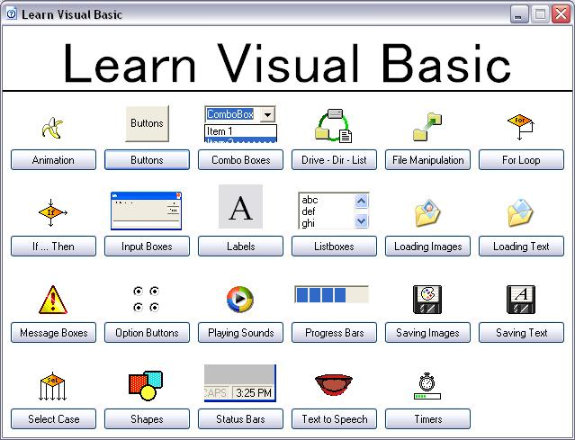



## Learn Visual Basic \- Beginners, Start Here

### Description

I first found Planet-Source-Code.com in the seventh grade, and as a programming enthusiast (with then only minuscule experience), I instantly latched on to those helpful submissions encompassing so many of the basic aspects of programming. In return for all the help this site has given me over the years (&gt;5 years experience and even as just a high-school senior a job as a programmer) I have decided to finally submit my own contribution.

I designed this with the near know-nothing computer enthusiast in mind-- those desiring to learn visual basic (as well as general programming concepts) but still having trouble finding good resources of information. From the main menu, you may select a topic, wherein its respective window will appear. You will then be able to actively explore each subject as it will appear to the user and by clicking on the question mark in the lower right-hand corner, draw up a screen showing the exact code and APIs/applicable controls. And for those who have moved beyond these tutorials, there is also the actual program's code to be read. Overall, it should be quite a helpful guide. Covered are subjects such as:

&gt; Simple animations

&gt; Button events and properties

&gt; Combo boxes (and managing their data)

&gt; Drive, Directory, and File List controls (linking, etc.)

&gt; File manipulation

&gt; Input boxes

&gt; Labels (properties and styles)

&gt; Listboxes (and managing their data)

&gt; Loading images from files

&gt; Loading text from files

&gt; Message boxes (formatting, styles, and returns)

&gt; Option buttons

&gt; Playing .wav files

&gt; Progress bars

&gt; Saving image files

&gt; Saving text files

&gt; Visual Basic Shapes (styles and properties)

&gt; Status bars

&gt; Text to speech

&gt; Timers

And such general programming concepts as:

&gt; For loops

&gt; If...Then...Else statements

&gt; Select...Case structures

&gt; And many others in the program's code itself!

I only hope this can be a truly helpful aid for those trying to begin programming, and might perhaps fill in any possible gaps from those programs that so helped me when I was just beginning...

Good luck and happy coding!

* As a side note, XP-styling on controls will only be applied upon compilation execution of the .exe file.
 
### More Info
 

             |
---                |---
**Submitted On**   |2007-02-11 18:01:58
**By**             |[0x24a537r9](https://github.com/Planet-Source-Code/PSCIndex/blob/master/ByAuthor/0x24a537r9.md)
**Level**          |Beginner
**User Rating**    |4.9 (49 globes from 10 users)
**Compatibility**  |VB 6\.0
**Category**       |[Miscellaneous](https://github.com/Planet-Source-Code/PSCIndex/blob/master/ByCategory/miscellaneous__1-1.md)
**World**          |[Visual Basic](https://github.com/Planet-Source-Code/PSCIndex/blob/master/ByWorld/visual-basic.md)
**Archive File**   |[Learn\_Visu2048062162007\.zip](https://github.com/Planet-Source-Code/0x24a537r9-learn-visual-basic-beginners-start-here__1-67834/archive/master.zip)

